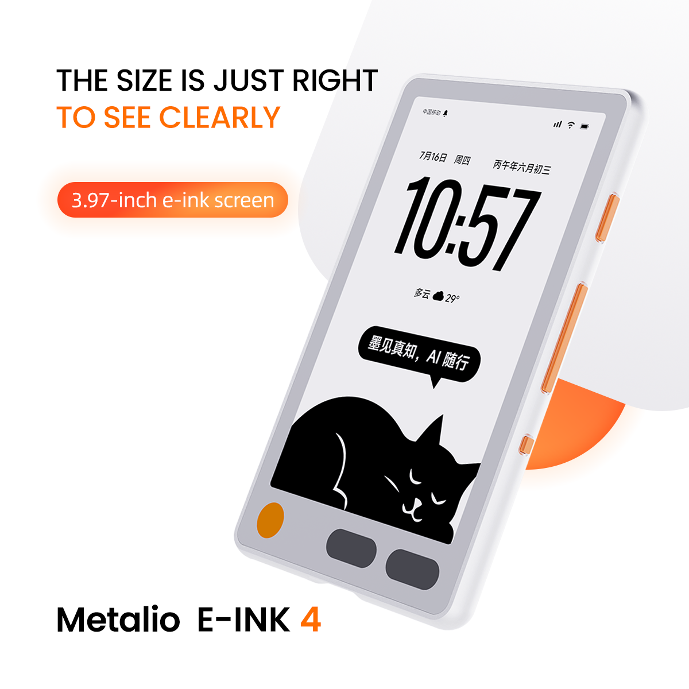
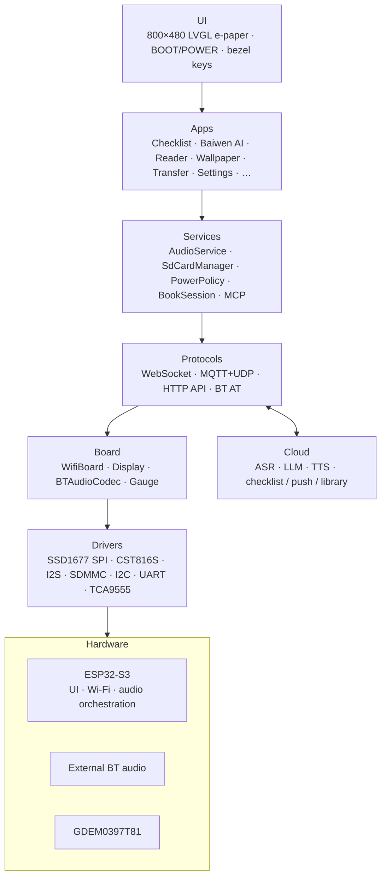
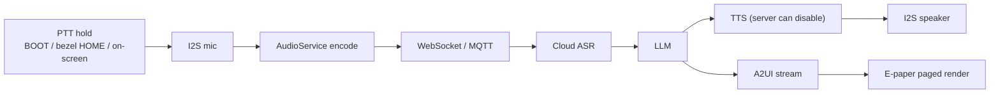
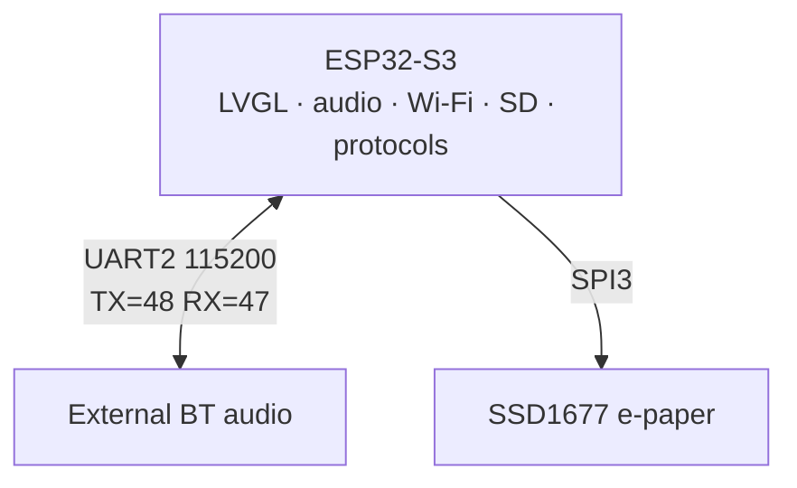
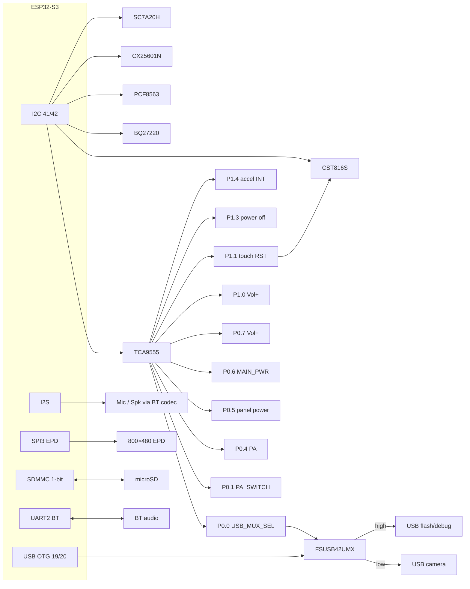
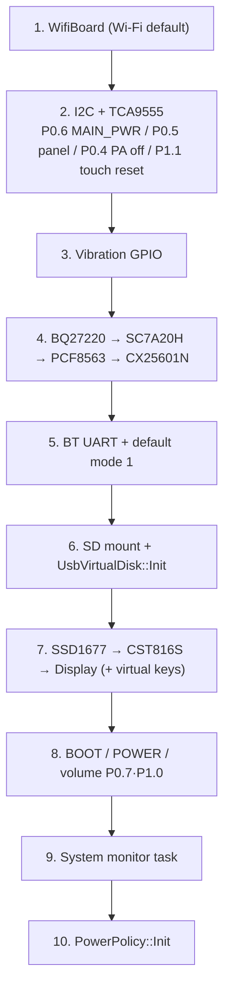

# Metalio E-Ink 4

<p align="center">
  
</p>

[中文](README_zn.md) | **English**

**Quick links**

- ESP-IDF docs: [ESP32-S3 Get Started v5.5.4](https://docs.espressif.com/projects/esp-idf/en/v5.5.4/esp32s3/get-started/index.html)

---

## Contents

1. [Product overview](#1-product-overview)
2. [Core features](#2-core-features)
3. [Use cases](#3-use-cases)
4. [System architecture](#4-system-architecture)
5. [Hardware specs](#5-hardware-specs)
6. [Network architecture](#6-network-architecture)
7. [Peripherals and pins](#7-peripherals-and-pins)
8. [Schematics and docs](#8-schematics-and-docs)
9. [Software architecture](#9-software-architecture)
10. [Cloud services and APIs](#10-cloud-services-and-apis)
11. [Built-in apps](#11-built-in-apps)
12. [Protocols](#12-protocols)
13. [Development environment](#13-development-environment)
14. [Build and flash](#14-build-and-flash)
15. [Debug and FAQ](#15-debug-and-faq)

---

## 1. Product overview

**Metalio E-Ink 4** is an open-source e‑ink hardware device designed for reading and AI-assistant scenarios. It features a 3.97″ 800 × 480 e‑paper panel (GDEM0397T81 / SSD1677), CST816S capacitive touch, cover-glass virtual keys, an I²S microphone and speaker (via an external Bluetooth audio codec), microSD, on-board Wi‑Fi, SC7A20H 3-axis accelerometer, PCF8563 RTC, BQ27220 fuel gauge, a vibration motor, and a USB camera / firmware-flash path multiplexer. The device supports voice interaction with cloud AI, local library reading, cloud content push, standby wallpapers, SD / USB storage, and low-power management.

| Attribute | Description |
|:---|:---|
| **Product name** | Metalio E-Ink 4 |
| **Board id** | `metalio-e-ink-4` (`BOARD_NAME` / provisioning AP prefix `MetalioEInk4`) |
| **MCU** | ESP32-S3 (Xtensa LX7; Flash **16 MB**, Octal PSRAM) |
| **Display** | 3.97" SPI e-paper, 800×480, SSD1677; CST816S touch |

Product data lives under SD `metalio/e-ink/`. Cloud APIs use **ink-screen** push and library sync. The e-paper UI uses full / partial refresh; lists and the reader do not scroll.

---

## 2. Core features

### 2.1 AI voice

- **Streaming ASR / LLM / TTS**: WebSocket or MQTT+UDP
- **Baiwen AI**: Push-to-Talk + A2UI paged UI; can create Daily checklist items by voice (see [§11.2](#112-baiwen-ai-assistant))

### 2.2 E-paper reading

- **E-paper UI**: LVGL I1 / A2I1; full and partial refresh; lists and reader **must not scroll** — page with bezel keys or volume keys (TCA9555 **P0.7** − / **P1.0** +)
- **Library**: 3×3 cover grid → detail → body; `.ebook` / `.epub` / `.txt`
- **Fonts**: UI fontpack on Flash `font_data`; reader `.ef` fonts on SD or via Transfer
- **Toolchain**: `tools/ebook/` converts PDF/EPUB/MOBI/TXT to device `.ebook` (with Web preview)

### 2.3 Local multimodal features

- **Daily checklist**: cloud sync + local cache (also shown on classic standby)
- **Wallpaper**: SD gallery; can be standby fullscreen or shutdown image
- **Transfer**: cloud push of books, wallpapers, fonts to SD
- **Sensors**: SC7A20H accel; PCF8563 RTC; BQ27220 gauge
- **USB camera**: see USB path switching below

### 2.4 Connectivity

- **Wi-Fi**: ESP32-S3 2.4 GHz; AP name like `MetalioEInk4-xxxx`
- **Bluetooth audio**: external chip over UART AT, three modes (see [§12.1](#121-bluetooth-audio-three-modes))
- **Virtual USB disk**: Settings → Storage exposes microSD as USB MSC (shares GPIO19/20 with Serial/JTAG — **mutually exclusive**)

#### USB path switching (FSUSB42UMX)

ESP32-S3 USB DM/DP (GPIO19/20) go through an on-board **FSUSB42UMX** 2:1 switch. TCA9555 **P0.0** (`USB_MUX_SEL`) selects the path:

| `USB_MUX_SEL` (P0.0) | Path |
|:---:|:---|
| **Low** | USB **camera** |
| **High** | USB **flash / debug** (Serial/JTAG) |

The same GPIO19/20 pair can also become an MSC virtual disk, exclusive with the flash path — do not use both at once.


### 2.5 Power and battery life

- **Single-cell Li-ion** + TI **BQ27220** (I2C 0x55); SOC is voltage-linear (see `docs/battery-soc-and-charge.md`)
- **Charging**: **USB → CX25601N** (I2C 0x6B); charge current **500 mA**
- **Power key**: side key into power-management IC; firmware pulses TCA9555 **P1.3** (`PWR_KEY_PULSE`, schematic P13) for software power-off
- **Idle policy** (Settings → Power, `PowerPolicy`):
  - **Idle → light-sleep standby**: default **3 min** (10 / 30 optional) → standby overlay (classic clock / wallpaper)
  - **Standby cumulative power-off**: default **3 min** (10 / 30 optional)
  - **AppIdle CPU**: 80 / 160 / **240 MHz** (default 240); Wi-Fi may be turned off to save power
  - **Network grace**: keep network **30 / 60 / 120 s** after needs clear
- **Buttons**:
  - **POWER short press**: enter / leave standby overlay
  - **POWER long press ~3 s**: hard power-off
  - **BOOT long press ~500 ms**: Baiwen PTT / standby hold-through, etc. (`power_policy.h`)

PA (TCA9555 **P0.4**) is enabled only in phone/BT full-power tiers or Speaking / audio tests; Connecting / Listening keep network without forcing PA. Audio source select is **P0.1** (`PA_SWITCH`).

---

## 3. Use cases

Home enables these six apps (`home_screen.cc` → `kApps[]`):

| App | Typical use |
|:---|:---|
| **Daily checklist** | Cloud todos: sync, complete, delete |
| **Baiwen AI** | Push-to-talk Q&A with A2UI; can create Daily checklist items by voice |
| **Reader** | Local library browse and paged reading (volume keys P0.7 / P1.0) |
| **Wallpaper** | Wallpaper gallery; standby / shutdown art |
| **Transfer** | Cloud push of books, wallpapers, fonts |
| **Settings** | Network, theme, haptics, power, conversation, storage, Bluetooth, test, about |

---

## 4. System architecture



### 4.1 Voice data path (Baiwen)



---

## 5. Hardware specs

| Category | Spec |
|:---|:---|
| **MCU** | ESP32-S3; Flash 16 MB; Octal PSRAM @ 80 MHz |
| **Storage** | On-board Flash (`partitions/v1/16m.csv`) + microSD (SDMMC **1-bit**) |
| **Display** | GDEM0397T81, 3.97", 800×480, SPI SSD1677, 10 MHz |
| **Touch** | CST816S (I2C 0x15, 400 kHz); INT=GPIO1; RST=TCA9555 **P1.1** (schematic P11, active low) |
| **Bezel keys** | HOME / PREV / NEXT (CST816S coords; see [§7.1](#71-esp32-s3-gpio)) |
| **Audio** | External BT audio + I2S mic/spk @ 16 kHz; codec / speaker / headset |
| **Network** | On-chip Wi-Fi |
| **Bluetooth** | External audio chip UART (GPIO 48/47, 115200); not ESP32 Classic BT stack |
| **Sensors** | SC7A20H accel (INT = TCA9555 **P1.4**); PCF8563 RTC |
| **Power** | Single-cell + BQ27220; CX25601N charger (USB); main rail TCA9555 **P0.6** (`MAIN_PWR`); panel socket **P0.5** |
| **Haptics** | GPIO44 motor (active high; default 35 ms pulse) |
| **Audio PA** | TCA9555 **P0.4** (`PA`) enable; **P0.1** (`PA_SWITCH`) source select |
| **Buttons** | BOOT (GPIO0), POWER (GPIO3); Vol− = TCA9555 **P0.7**, Vol+ = **P1.0** (both active low) |
| **USB** | OTG FS (GPIO19/20): FSUSB42UMX 2:1 (camera / flash), or MSC (exclusive) |
| **Camera** | USB camera; `USB_MUX_SEL` = TCA9555 **P0.0** (low = camera, high = flash) |

---

## 6. Network architecture

Metalio E-Ink 4 is built around **ESP32-S3** with on-chip Wi-Fi:



| Unit | Role | Interface | Duties |
|:---|:---|:---|:---|
| **ESP32-S3** | Host | — | UI, audio orchestration, Wi-Fi, SD, protocols, MCP, reader |
| **BT audio** | Codec / speaker / headset | UART AT | Three modes (§12.1) |

> Networking is Wi-Fi. Provision and connect under **Settings → Network**.

---

## 7. Peripherals and pins

Pins: `main/boards/metalio-e-ink-4/config.h`  
IO expander map: `main/boards/common/IOExpander.hpp`

### 7.1 ESP32-S3 GPIO

| Function | GPIO | Notes |
|:---|:---:|:---|
| I2C SDA | 41 | Shared: touch, TCA9555, BQ27220, RTC, charger, accel |
| I2C SCL | 42 | |
| I2S mic WS | 43 | |
| I2S mic DIN | 17 | |
| I2S spk BCLK | 6 | |
| I2S spk DOUT | 7 | |
| BT audio TX | 48 | UART2, 115200 |
| BT audio RX | 47 | |
| BOOT | 0 | |
| POWER | 3 | Power IC / standby / shutdown |
| EPD MOSI | 8 | SPI3, 10 MHz |
| EPD SCLK | 14 | |
| EPD CS | 45 | |
| EPD DC | 13 | |
| EPD RST | 18 | |
| EPD BUSY | 9 | |
| SDMMC CLK | 38 | 1-bit |
| SDMMC CMD | 40 | |
| SDMMC D0 | 39 | |
| SDMMC DAT3/CD | 46 | Input+pull-up only; must stay high (avoid SPI card mode) |
| USB DM / DP | 19 / 20 | Via FSUSB42UMX: camera or flash; also MSC |
| Touch INT | 1 | |
| IO expander INT | 2 | |
| Vibration | 44 | Active high |

**Bezel virtual-key coordinates** (CST816S native portrait, matches LVGL 480×800; Y=900 is outside the panel):

| Key | X | Y | Typical use |
|:---|:---:|:---:|:---|
| HOME | 80 | 900 | Back / Baiwen PTT long-press |
| NEXT | 240 | 900 | Next page |
| PREV | 400 | 900 | Previous page |

### 7.2 TCA9555 (I2C 16-bit, addr 0x20)

| Logic pin | HW | Dir | Function |
|:---|:---:|:---:|:---|
| `USB_MUX_SEL` | P0.0 | OUT | FSUSB42UMX path: low = camera, high = flash/debug |
| `PA_SWITCH` | P0.1 | OUT | PA source select |
| `PA` | P0.4 | OUT | PA enable (policy-driven) |
| `SCREEN_SOCKET_PWR` | P0.5 | OUT | Display socket power |
| `MAIN_PWR` | P0.6 | OUT | Main rail; after drop+restore re-apply BT mode 1 |
| `VOLUME_DOWN` | P0.7 | IN | Volume − (active low) |
| `VOLUME_UP` | P1.0 | IN | Volume + |
| `TOUCH_RST` | P1.1 (schematic P11) | OUT | CST816 RST, active low |
| `PWR_KEY_PULSE` | P1.3 (schematic P13) | OUT | Shutdown pulse to power IC |
| `ACCEL_INT` | P1.4 | IN | Accel IRQ |

> Schematic names “P11 / P13” mean Port1 bit1 / bit3 → io_index 9 / 11 — do not confuse with decimal pin numbers.

### 7.3 I2C addresses

| Device | 7-bit addr | Notes |
|:---|:---:|:---|
| TCA9555 | 0x20 | IO expander |
| CST816S | 0x15 | Touch |
| PCF8563 | 0x51 | RTC |
| BQ27220 | 0x55 | Fuel gauge |
| CX25601N | 0x6B | Charger |
| SC7A20H | 0x19 | Accel |

### 7.4 Peripheral diagram



---

## 8. Schematics and docs

| Doc | Path |
|:---|:---|
| Battery / charge policy | [`docs/battery-soc-and-charge.md`](docs/battery-soc-and-charge.md) |
| EPD Bayer dither | [`docs/epd-bayer-dither-gray.md`](docs/epd-bayer-dither-gray.md) |
| Custom board guide | [`docs/custom-board.md`](docs/custom-board.md) |

If schematics are published elsewhere, follow the hardware team docs; firmware pin truth is `config.h` / `IOExpander.hpp`.

---

## 9. Software architecture

Firmware is based on [xiaozhi-esp32](https://github.com/78/xiaozhi-esp32), customized for `metalio-e-ink-4`. CMake project name `xiaozhi`.

### 9.1 Layers

| Layer | Path / module | Role |
|:---|:---|:---|
| **Entry** | `main.cc` → `Application` | Boot, event loop, state machine |
| **Board** | `boards/metalio-e-ink-4/` | HW init, pins, EPD/touch |
| **Display** | `display/screen/*`, `lv_adapter_display` | Apps, e-paper refresh, status bar |
| **Reader** | `reader/`, `tools/ebook/` | Book session, `.ebook` toolchain |
| **Audio** | `audio/` | Codec, record / play |
| **Protocols** | `protocols/` | WebSocket, MQTT+UDP |
| **MCP** | `mcp_server.cc` | On-device Model Context Protocol |
| **Power** | `boards/common/power_policy/` | Power tiers, standby, shutdown |
| **Common** | `boards/common/` | Wi-Fi, SD, gauge, USB MSC, BT codec |

### 9.2 State machine

`Application` states include starting → configuring → idle → connecting → listening ↔ speaking, plus upgrading / activating / fatal_error, etc.

- **idle**: Baiwen and similar pages declare network needs via `PowerNeed` / audio session
- **listening / speaking**: streaming ASR / TTS
- **OTA**: dual slots `ota_0` / `ota_1`; fullscreen `OtaUpgradeScreen`

### 9.3 Board init order

Approx. `MetalioEInk4Board` constructor sequence:



### 9.4 Tree (excerpt)

```
main/
├── application.cc                 # boot, state machine, protocol dispatch
├── cloudzao_endpoints.c           # private cloud host/paths (empty in OSS)
├── api_endpoints.h                # URL helpers (no host literals)
├── boards/metalio-e-ink-4/        # board (config.h / SSD1677 / touch)
├── boards/common/                 # Wi-Fi, SD, gauge, power, USB MSC
├── display/screen/                # apps, standby, OTA, settings
├── display/a2ui/                  # A2UI render
├── reader/                        # e-book session
├── audio/                         # record / play
└── protocols/                     # WebSocket / MQTT

tools/ebook/                       # .ebook convert, Web, emulator
tools/fontpack/                    # UI font packaging
partitions/v1/16m.csv              # active 16MB partition table
use_font/font.fontpack             # merged into font_data
merge_firmware.sh                  # build + merge full bin
```

### 9.5 Flash partitions (`sdkconfig` → `partitions/v1/16m.csv`)

| Partition | ~Size | Use |
|:---|:---|:---|
| `nvs` / `otadata` / `phy_init` | 16K / 8K / 4K | NVS, OTA meta, PHY |
| `model` | 400K | Model partition (SPIFFS) |
| `ota_0` / `ota_1` | 5MB each | Dual OTA apps |
| `resources` | 400K | Resource SPIFFS |
| `font_data` | 5MB | UI fontpack (mmap) |
| `coredump` | 64K | Crash dump |

> `partitions/v2/` (assets layout) exists but is **not** used by the current board config. Partition table offset: `CONFIG_PARTITION_TABLE_OFFSET=0x8000`.

---

## 10. Cloud services and APIs

Cloud hosts and HTTP paths live in `main/cloudzao_endpoints.c`. Call sites only use `main/api_endpoints.h` to build URLs. In the current open-source build, those strings are intentionally blank, so the firmware does not use a private backend by default; if you deploy your own service, fill in the real values while keeping the symbol names unchanged.

Primary voice transport remains **WebSocket / MQTT+UDP** (`docs/websocket.md`, `docs/mqtt-udp.md`). Device tools can be exposed via **MCP** (`docs/mcp-protocol.md`, `docs/mcp-usage.md`).

---

## 11. Built-in apps

Home list: `home_screen.cc` → `kApps[]` (max 12 per page).

### 11.0 Home apps

| App | Description |
|:---|:---|
| **Daily checklist** | Cloud checklist + local cache; complete / delete / multi-select; VK paging |
| **Baiwen AI** | Voice assistant + A2UI paging; can create Daily checklist items by voice (§11.2) |
| **Reader** | Library 3×3 → detail → body; volume keys (P0.7 / P1.0) paging (§11.3) |
| **Wallpaper** | SD gallery; shutdown / standby (§11.4) |
| **Transfer** | Unified push list for books / wallpapers / fonts (§11.5) |
| **Settings** | Network / theme / haptics / power / conversation / storage / BT / test / about (§11.6) |

System pages (no home icon): **standby**, **OTA upgrade**, **touch-missing**, Settings-embedded **Bluetooth**.

---

### 11.1 Daily checklist (task)

- Reads `checklist_cache`; can refresh from API
- Complete / delete / multi-select; no scroll — use virtual keys
- Classic standby shows a read-only todo summary

### 11.2 Baiwen AI (assistant)

See [`main/display/screen/assistant_screen/README.md`](main/display/screen/assistant_screen/README.md).

- Enter page: start voice session; leave: stop
- **Multi-source PTT**: BOOT / bezel HOME / on-screen; hold ~**500 ms** to listen, release to end
- Server sends **A2UI**; device pages by glyph metrics (~1500 pages max), no scroll; `vk_prev` / `vk_next`; long-press ≈ ±10 pages/s
- **Math**: `Math`/`Formula` components (LaTeX subset) rendered on-device with Latin Modern Math; see [`main/display/a2ui/README.md`](main/display/a2ui/README.md#math设备端-latex-公式), sample [`math_formulas.json`](main/display/a2ui/examples/math_formulas.json)
- **Create Daily checklist by voice**: conversation can create todos on the cloud checklist and refresh local `checklist_cache` (visible in Checklist / standby)
- Session may persist under `/sdcard/metalio/e-ink/chat_log/` (cleared on boot; RAM-only without SD)
- Image cache: `.../a2ui_cache/` (cleared on boot)
- Settings → Conversation follows server TTS preference

### 11.3 Reader (book)

- Path: `/sdcard/metalio/e-ink/books` (user-facing `metalio/e-ink/books`)
- Formats: `.ebook` / `.epub` / `.txt`; `.txt.idx` index; side-car cover `.a2i1`
- Fonts: `.../fonts/*.ef` (e.g. `misans_25_2.ef`)
- Layout prefs in NVS; **no scroll** on list/body; VK / volume keys (TCA9555 **P0.7** / **P1.0**) page
- Boot may sync progress via `library/sync`
- PC conversion: [`tools/ebook/README.md`](tools/ebook/README.md)

### 11.4 Wallpaper and standby

- Gallery: `/sdcard/metalio/e-ink/wallpaper`, 3×3 browse / enable
- **Standby routing** (`standby_screen`):
  - Enabled standby wallpaper → fullscreen A2I1 (`standby_wallpaper`)
  - Else → classic (date / lunar / weather / todos, `standby_classic`)
- Touch may deep-sleep in standby; wake resets touch HW; full refresh then freeze flush when ready
- Shutdown image: NVS wallpaper first, else built-in `bg_shutdown.a2i1`

### 11.5 Transfer (cloud)

- Tabs: All / Wallpaper / Books / Fonts; **Refresh** pulls push queue
- Books / fonts open preview (`coverImageUrl`); wallpapers preview then download
- Landing dirs: BOOK→`books`, BADGE→`wallpaper`, FONT→`fonts`
- Status bar fixed title “传输” (no clock)

### 11.6 Settings

| Tab | Content |
|:---|:---|
| **Network** | Wi-Fi provisioning and connection |
| **Theme** | Home card style (fill / stipple / outline) |
| **Haptics** | Key vibration on / off |
| **Power** | AppIdle CPU, standby delay, network grace, cumulative power-off |
| **Conversation** | Baiwen TTS server preference |
| **Storage** | SD capacity; **enable / disable virtual USB disk** |
| **Bluetooth** | Modes 1/2/3, scan/pair (§12.1) |
| **Test** | Auto / touch / battery / aging factory entry |
| **About** | Model, chip, FW version, MAC, Flash, PSRAM |

### 11.7 SD layout

Product root: `/sdcard/metalio/e-ink/` (`sd_paths.h`)

| Path | Use |
|:---|:---|
| `.../books` | E-books, covers, indexes |
| `.../fonts` | Reader `.ef` fonts |
| `.../wallpaper` | Wallpapers / shutdown art |
| `.../chat_log` | Baiwen session JSON (cleared on boot) |
| `.../a2ui_cache` | A2UI image cache (cleared on boot) |
| `.../recordings` | Opus recordings (Recording app) |

---

## 12. Protocols

| Protocol | Use |
|:---|:---|
| **WebSocket** | Streaming voice (ASR/LLM/TTS) |
| **MQTT + UDP** | Alternate uplink |
| **MCP** | Expose device tools to LLMs |
| **HTTP** | Checklist, weather, push, library, TTS prefs, ASR |
| **BT AT** | External BT audio module |

### 12.1 Bluetooth audio three modes

ESP32-S3 sends AT commands over **UART2** (115200, GPIO 48/47). Settings → Bluetooth embeds `BluetoothScreen`. This is **not** the ESP32 Classic Bluetooth stack.

| Mode | AT sequence (each ends with `\r\n`) | Meaning | How to enter |
|:---:|:---|:---|:---|
| **1** | `AT+RX=2` → (~700 ms) → `AT+MODE=1` | Baiwen conversation (boot default) | Auto at boot; Settings |
| **2** | `AT+TX=1` → → `AT+MODE=2` | TX / pair; talk via BT headset | Settings → Bluetooth → mode 2; `AT+INQUIRING` / `AT+CONNECT=` |
| **3** | `AT+RX=1` → → `AT+MODE=3` | Music sink (device as speaker) | Settings |

> Mode 2 conversation requires a headset **with mic**. Module echoes e.g. `SET MODE 1`. Call / music also use `AT+BTSCO` / `AT+PP`.

After `InitializeBTAudio`, boot calls `BluetoothScreen::ApplyDefaultMode()` for mode 1.

---

## 13. Development environment

### 13.1 Requirements

| Item | Requirement |
|:---|:---|
| **ESP-IDF** | **v5.5.4** (must match repo `sdkconfig`) |
| **Target** | ESP32-S3 (`config.json` / checked-in `sdkconfig`; usually no `set-target`) |
| **Board** | Metalio E-Ink 4 (`main/boards/metalio-e-ink-4/`) |
| **OS** | Linux / macOS / Windows (WSL2 recommended) |
| **Python** | 3.8+ (IDF venv) |

### 13.2 Install ESP-IDF

> [ESP32-S3 Get Started — ESP-IDF v5.5.4](https://docs.espressif.com/projects/esp-idf/en/v5.5.4/esp32s3/get-started/index.html)

```bash
git clone -b v5.5.4 --recursive https://github.com/espressif/esp-idf.git
cd esp-idf
./install.sh esp32s3
. ./export.sh
idf.py --version
```

### 13.3 Get the source

```bash
git clone <your-repo-url>
cd xingzhi-ai-397
```

> Repo ships a board-tuned `sdkconfig`; typically `idf.py build` is enough.

### 13.4 Key config summary

| Item | Value | Notes |
|:---|:---|:---|
| ESP-IDF | v5.5.4 | Must match |
| Target | esp32s3 | Preconfigured |
| Flash | 16MB | `partitions/v1/16m.csv` |
| PSRAM | Octal 80MHz | |

---

## 14. Build and flash

### 14.1 Build

```bash
. ~/esp/v5.5.4/export.sh   # adjust path

idf.py build
```

### 14.2 About sdkconfig

**Do not edit `sdkconfig` casually.** It is tuned for e-paper, PSRAM, and partitions. Bad edits can break refresh, Wi-Fi, or SD mount.

### 14.3 Merge full firmware (release)

```bash
./merge_firmware.sh
# or: IDF_PATH=~/esp/v5.5.4 ./merge_firmware.sh
```

Builds and merges per `build/flash_args` (including `use_font/font.fontpack` into `font_data`):

- `firmware/metalio-e-ink4-{PROJECT_VER}.bin`
- Root `metalio-e-ink-4.bin`
- `daily-builds/metalio-e-ink-4-<timestamp>.bin` (local archive)

### 14.4 Flash and monitor

```bash
# Change port for your machine (often /dev/ttyACM0 on Linux)
idf.py -p /dev/ttyACM0 flash monitor
```

While **virtual USB disk** is enabled, the same USB port is MSC and Serial/JTAG is unavailable — disable MSC or close monitor first.

### 14.5 SD card and virtual USB disk

1. Format FAT32 and insert.
2. Put assets under `metalio/e-ink/...` per [§11.7](#117-sd-layout) (do not nest an extra folder named `sdcard` on the PC).
3. Settings → Storage → enable virtual USB disk; copy files; eject safely; then disable.

USB strings example: `Metalio` / `Metalio Ink SD` (TinyUSB).

### 14.6 E-book conversion (PC)

See [`tools/ebook/README.md`](tools/ebook/README.md). Copy outputs into SD `metalio/e-ink/books/` for the Reader app.

---

## 15. Debug and FAQ

### 15.1 Common log tags

| Tag | Module |
|:---|:---|
| `MetalioEInk4Board` | Board init |
| `IOExpander` | TCA9555 |
| `PowerPolicy` / `power_hw` | Low power / shutdown |
| `AssistantScreen` | Baiwen AI |
| `BookScreen` | Reader |
| `CloudScreen` | Transfer |
| `BluetoothScreen` | BT AT |
| `LVAdapterDisplay` | E-paper refresh |

### 15.2 Factory test entry

Settings → Test: auto tests (Wi-Fi / audio / sensors), touch, battery (voltage/current vs charge setpoint), aging, etc. End users can ignore.

### 15.3 FAQ

**Q: ESP-IDF version mismatch**

Use **v5.5.4** and run `export.sh`.

**Q: Display does not refresh / garbled**

1. Confirm `sdkconfig` and board panel params were not broken  
2. Check TCA9555 **P0.5** (`SCREEN_SOCKET_PWR`) / **P0.6** (`MAIN_PWR`)  
3. Verify BUSY / SPI pins in `config.h`

**Q: Touch dead**

May be standby deep-sleep (POWER short press to wake); check CST816 RST (TCA9555 P1.1) and INT (GPIO1); extreme cases show `touch_missing_screen`.

**Q: Wi-Fi provisioning**

Settings → Network → Wi-Fi; connect to AP `MetalioEInk4-*` and follow on-device UI.


**Q: SD mount failed**

FAT32; check SDMMC 1-bit pins; keep DAT3 (GPIO46) high.

**Q: Cannot flash after virtual USB disk**

Disable MSC / eject safely to restore Serial/JTAG, then `idf.py flash`.

**Q: Device enters standby or powers off after idle**

Expected — see [§2.5](#25-power-and-battery-life). Adjust in Settings → Power.

**Q: Battery % jumps / charge icon odd**

See [`docs/battery-soc-and-charge.md`](docs/battery-soc-and-charge.md). UI SOC is voltage-estimated and is not the USB-port total current.

**Q: Push / library API fails**

Confirm network; host is `xxx.xxxx.cn`; use Transfer **Refresh**.

---

*This document tracks firmware changes. Prefer source for pins and behavior; open an Issue if docs disagree with hardware.*
