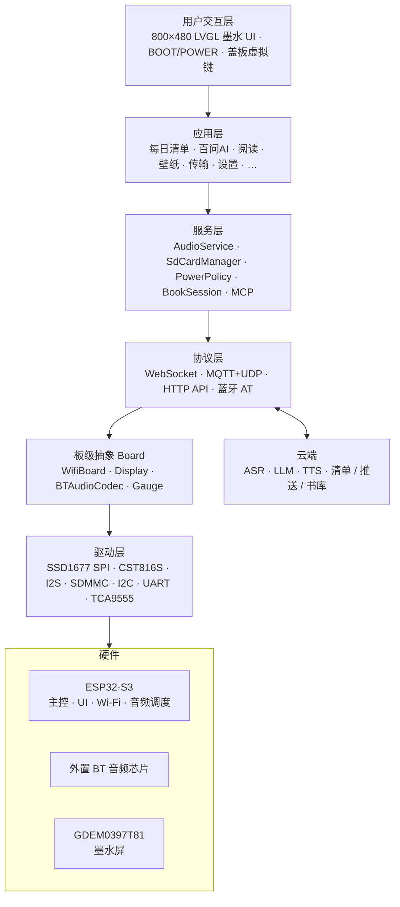
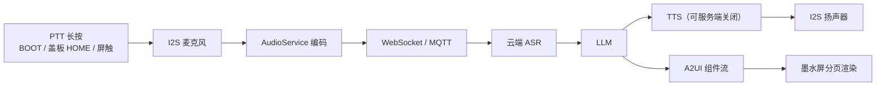
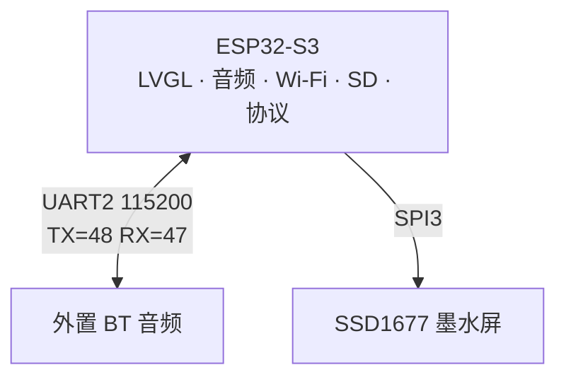
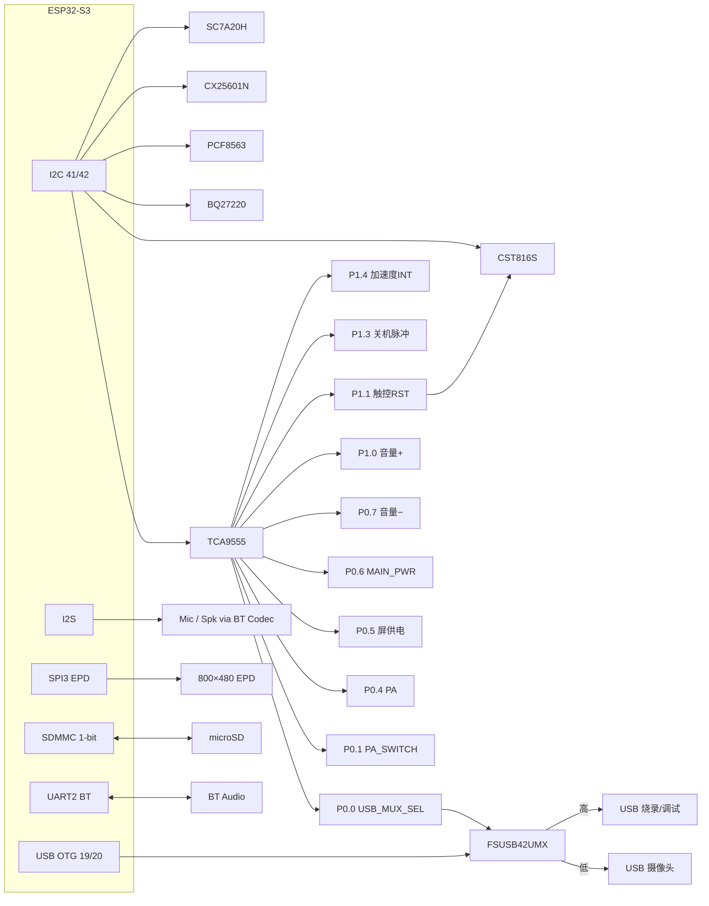
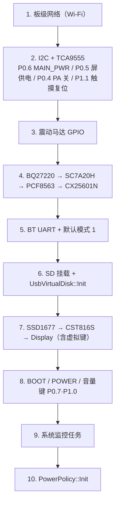

# Metalio E-Ink 4

<p align="center">
  
</p>

**中文** | [English](README.md)

**快速链接**

- ESP-IDF 官方文档：[ESP32-S3 快速入门 v5.5.4](https://docs.espressif.com/projects/esp-idf/zh_CN/v5.5.4/esp32s3/get-started/index.html)

---

## 目录

1. [产品概述](#1-产品概述)
2. [核心特性](#2-核心特性)
3. [应用场景](#3-应用场景)
4. [系统架构](#4-系统架构)
5. [硬件规格](#5-硬件规格)
6. [网络架构](#6-网络架构)
7. [外设与引脚](#7-外设与引脚)
8. [原理图与资料](#8-原理图与资料)
9. [软件架构](#9-软件架构)
10. [云端服务与 API](#10-云端服务与-api)
11. [内置应用](#11-内置应用)
12. [通信协议](#12-通信协议)
13. [开发环境](#13-开发环境)
14. [编译与烧录](#14-编译与烧录)
15. [调试与常见问题](#15-调试与常见问题)

---

## 1. 产品概述

**Metalio E-Ink 4** 是一款面向阅读与 AI 助手场景的开源墨水屏实体设备。整机搭载 **3.97 寸 800×480** 电子纸（GDEM0397T81 / SSD1677）、CST816S 电容触控、盖板虚拟键、I2S 麦克风与扬声器（经外置蓝牙音频芯片）、microSD、片上 Wi‑Fi、SC7A20H 三轴加速度计、PCF8563 RTC、BQ27220 电量计、震动马达，以及 USB 摄像头 / 烧录通路切换能力。设备可通过语音与云端 AI 交互，并支持本地书库阅读、云端资源推送、待机壁纸、SD/U 盘存储与低功耗管理。

| 属性 | 说明 |
|:---|:---|
| **产品名称** | Metalio E-Ink 4 |
| **板级标识** | `metalio-e-ink-4`（`BOARD_NAME` / 配网 AP 前缀 `MetalioEInk4`） |
| **主控芯片** | ESP32-S3（Xtensa LX7；Flash **16 MB**，Octal PSRAM） |
| **屏幕** | 3.97 寸 SPI 墨水屏，800×480，SSD1677；CST816S 电容触控 |

产品数据落在 SD 的 `metalio/e-ink/`，云端接口走 **ink-screen** 推送与书库同步；墨水屏采用全刷 / 局刷，列表与阅读页禁止滚动。

---

## 2. 核心特性

### 2.1 AI 语音交互

- **流式 ASR / LLM / TTS**：经 WebSocket 或 MQTT+UDP 上云
- **百问 AI**：Push-to-Talk + A2UI 组件分页展示；可语音创建每日清单（见 [§11.2](#112-百问-aiassistant)）

### 2.2 墨水屏阅读体验

- **电子纸专用 UI**：LVGL I1 / A2I1；全刷与局刷策略；列表与阅读页 **禁止滚动**，用盖板虚拟键或音量键（TCA9555 **P0.7**− / **P1.0**+）翻页
- **书库**：九宫格封面 + 书名 → 详情大图 → 正文；支持 `.ebook` / `.epub` / `.txt`
- **字体**：Flash `font_data` 分区挂载 UI fontpack；阅读字体 `.ef` 可放 SD 或经「传输」下载
- **工具链**：`tools/ebook/` 可将 PDF/EPUB/MOBI/TXT 等转为设备可读 `.ebook`（含 Web 预览）

### 2.3 多模态与本地能力

- **每日清单**：云端 checklist 同步，本地缓存只读展示（待机页复用）
- **壁纸**：SD 壁纸库；可设为待机全屏图 / 关机图
- **传输**：云端推送书籍、壁纸、字体到本机 SD
- **传感器**：SC7A20H 三轴加速度计；PCF8563 RTC；BQ27220 电量计
- **USB 摄像头**：见下方 USB 通路切换

### 2.4 连接能力

- **Wi-Fi**：ESP32-S3 片上 2.4 GHz；配网 AP 名形如 `MetalioEInk4-xxxx`
- **蓝牙音频**：外置蓝牙音频芯片（UART AT），三种工作模式（见 [§12.1](#121-蓝牙音频与三种模式)）
- **虚拟 U 盘**：设置「存储」可将 microSD 以 USB MSC 暴露给电脑（与 USB Serial/JTAG **共用 GPIO19/20，互斥**）

#### USB 通路切换（FSUSB42UMX）

ESP32-S3 的 USB DM/DP（GPIO19/20）经板载 **FSUSB42UMX** 二选一开关，接到外设侧。TCA9555 **P0.0**（`USB_MUX_SEL`）控制选路：

| `USB_MUX_SEL`（P0.0） | 通路 |
|:---:|:---|
| **低** | USB **摄像头** |
| **高** | USB **烧录 / 调试**（Serial/JTAG） |

同一组 GPIO19/20 还可切到 MSC 虚拟 U 盘，与烧录口互斥，勿同时占用。


### 2.5 电源与续航

- **单节锂电** + TI **BQ27220** 电量计（I2C 0x55）；SOC 由电压线性估算（详见 `docs/battery-soc-and-charge.md`）
- **充电**：**USB → CX25601N**（I2C 0x6B）；充电电流 **500 mA**
- **开关机**：侧面电源键接入开关机芯片；固件经 TCA9555 **P1.3**（`PWR_KEY_PULSE`，原理图 P13）输出脉冲做软件关机
- **空闲策略**（「设置 → 功耗」，`PowerPolicy`）：
  - **无操作进浅睡待机**：默认 **3 分钟**（可选 10 / 30 分钟）→ 待机 Overlay（经典时钟 / 壁纸）
  - **浅睡累计关机**：默认 **3 分钟**（可选 10 / 30 分钟）
  - **AppIdle CPU**：80 / 160 / **240 MHz**（默认 240）；可关 Wi-Fi 降功耗
  - **断网暂留**：无保网需求后仍保网 **30 / 60 / 120 秒**
- **按键**：
  - **POWER 短按**：进入 / 退出待机 Overlay
  - **POWER 长按约 3 秒**：硬关机
  - **BOOT 长按约 500 ms**：百问 PTT / 待机 hold-through 等（见板级与 `power_policy.h`）

功放（PA，TCA9555 **P0.4**）仅在电话 / 蓝牙满功率档或 Speaking / 音频测试时打开；Connecting / Listening 保网但不强拉 PA。音源切换为 **P0.1**（`PA_SWITCH`）。

---

## 3. 应用场景

主屏启用以下 6 个 App（`home_screen.cc` → `kApps[]`）：

| App | 典型用途 |
|:---|:---|
| **每日清单** | 云端待办同步与完成 / 删除 |
| **百问 AI** | 按住说话，语音问答与 A2UI 展示；可语音创建每日清单 |
| **阅读** | 本地书库浏览与正文翻页阅读（音量键 P0.7 / P1.0） |
| **壁纸** | 壁纸库管理；待机 / 关机图 |
| **传输** | 云端推送书籍、壁纸、字体到本机 |
| **设置** | 网络、主题、震动、功耗、对话、存储、蓝牙、测试、关于 |

---

## 4. 系统架构



### 4.1 数据流（百问语音）



---

## 5. 硬件规格

| 类别 | 规格 |
|:---|:---|
| **主控** | ESP32-S3；Flash 16 MB；Octal PSRAM @ 80 MHz |
| **存储** | 板载 Flash（分区表 `partitions/v1/16m.csv`）+ microSD（SDMMC **1-bit**） |
| **屏幕** | GDEM0397T81，3.97"，800×480，SPI SSD1677，10 MHz |
| **触控** | CST816S（I2C 0x15，400 kHz）；INT=GPIO1；RST=TCA9555 **P1.1**（原理图 P11，低有效） |
| **盖板键** | 外侧 HOME / PREV / NEXT 虚拟键（CST816S 坐标，见 [§7.1](#71-esp32-s3-直接-gpio)） |
| **音频** | 外置蓝牙音频芯片 + I2S Mic/Spk，16 kHz；兼作 Codec / 蓝牙音箱 / 蓝牙耳机连接 |
| **网络** | 片上 Wi-Fi |
| **蓝牙** | 外置音频芯片 UART（GPIO 48/47，115200）；非 ESP32 经典蓝牙协议栈 |
| **传感器** | SC7A20H 加速度计（INT=TCA9555 **P1.4**）；PCF8563 RTC |
| **电源** | 单节锂电 + BQ27220；充电 CX25601N（USB）；总电源 TCA9555 **P0.6**（`MAIN_PWR`）；屏卡座供电 **P0.5** |
| **震动** | GPIO44 马达（高有效；虚拟键短震默认 35 ms） |
| **音频功放** | TCA9555 **P0.4**（`PA`）使能；**P0.1**（`PA_SWITCH`）选音源 |
| **按键** | BOOT（GPIO0）、POWER（GPIO3）；音量−=TCA9555 **P0.7**，音量+=**P1.0**（均低有效） |
| **USB** | OTG FS（GPIO19/20）：经 FSUSB42UMX 二选一（摄像头 / 烧录），亦可 MSC（互斥） |
| **摄像头** | USB 摄像头；`USB_MUX_SEL`=TCA9555 **P0.0**（低=摄像头，高=烧录） |

---

## 6. 网络架构

Metalio E-Ink 4 主控为 **ESP32-S3**，Wi-Fi 片上完成：



| 单元 | 角色 | 接口 | 职责 |
|:---|:---|:---|:---|
| **ESP32-S3** | 主控 | — | UI、音频调度、Wi-Fi、SD、协议、MCP、阅读 |
| **BT 音频芯片** | Codec / 音箱 / 耳机 | UART AT | 三种模式（§12.1） |

> 网络由板级 Wi-Fi 管理。用户在「设置 → 网络」进行配网与连接。

---

## 7. 外设与引脚

引脚定义：`main/boards/metalio-e-ink-4/config.h`  
IO 扩展映射：`main/boards/common/IOExpander.hpp`

### 7.1 ESP32-S3 直接 GPIO

| 功能 | GPIO | 说明 |
|:---|:---:|:---|
| I2C SDA | 41 | 共享：触控、TCA9555、BQ27220、RTC、充电 IC、加速度计 |
| I2C SCL | 42 | |
| I2S 麦克风 WS | 43 | |
| I2S 麦克风 DIN | 17 | |
| I2S 扬声器 BCLK | 6 | |
| I2S 扬声器 DOUT | 7 | |
| BT 音频 TX | 48 | UART2，115200 |
| BT 音频 RX | 47 | |
| BOOT | 0 | |
| POWER | 3 | 开关机芯片 / 待机 / 关机 |
| EPD MOSI | 8 | SPI3，10 MHz |
| EPD SCLK | 14 | |
| EPD CS | 45 | |
| EPD DC | 13 | |
| EPD RST | 18 | |
| EPD BUSY | 9 | |
| SDMMC CLK | 38 | 1-bit |
| SDMMC CMD | 40 | |
| SDMMC D0 | 39 | |
| SDMMC DAT3/CD | 46 | 仅输入上拉，须保持高（防卡进 SPI 模式） |
| USB DM / DP | 19 / 20 | 经 FSUSB42UMX：摄像头或烧录；亦可 MSC |
| 触摸 INT | 1 | |
| IO 扩展 INT | 2 | |
| 震动马达 | 44 | 高有效 |

**盖板虚拟键坐标**（CST816S 原生竖屏，与 LVGL 480×800 一致；Y=900 在盖板外侧）：

| 键 | X | Y | 典型用途 |
|:---|:---:|:---:|:---|
| HOME | 80 | 900 | 返回 / 百问 PTT 长按 |
| NEXT | 240 | 900 | 下一页 |
| PREV | 400 | 900 | 上一页 |

### 7.2 TCA9555 IO 扩展器（I2C 16-bit，地址 0x20）

| 逻辑引脚 | 硬件 | 方向 | 功能 |
|:---|:---:|:---:|:---|
| `USB_MUX_SEL` | P0.0 | OUT | FSUSB42UMX 选路：低=摄像头，高=烧录/调试 |
| `PA_SWITCH` | P0.1 | OUT | 功放音源切换 |
| `PA` | P0.4 | OUT | 功放使能（策略按需打开） |
| `SCREEN_SOCKET_PWR` | P0.5 | OUT | 屏幕卡座供电 |
| `MAIN_PWR` | P0.6 | OUT | 总电源；掉电再上电后重发 BT 模式 1 |
| `VOLUME_DOWN` | P0.7 | IN | 音量−（低有效） |
| `VOLUME_UP` | P1.0 | IN | 音量+ |
| `TOUCH_RST` | P1.1（原理图 P11） | OUT | CST816 RST，低有效 |
| `PWR_KEY_PULSE` | P1.3（原理图 P13） | OUT | 向开关机芯片输出关机脉冲 |
| `ACCEL_INT` | P1.4 | IN | 加速度计中断 |

> 原理图网名「P11 / P13」指 Port1 的 bit1 / bit3，对应 io_index 9 / 11，勿与十进制脚号混淆。

### 7.3 I2C 设备地址

| 设备 | 7-bit 地址 | 说明 |
|:---|:---:|:---|
| TCA9555 | 0x20 | IO 扩展 |
| CST816S | 0x15 | 触控 |
| PCF8563 | 0x51 | RTC |
| BQ27220 | 0x55 | 电量计 |
| CX25601N | 0x6B | 充电 IC |
| SC7A20H | 0x19 | 加速度计 |

### 7.4 外设框图



---

## 8. 原理图与资料

| 资料 | 路径 |
|:---|:---|
| 电量与充电策略 | [`docs/battery-soc-and-charge.md`](docs/battery-soc-and-charge.md) |
| 墨水抖动灰度 | [`docs/epd-bayer-dither-gray.md`](docs/epd-bayer-dither-gray.md) |
| 自定义板指南 | [`docs/custom-board.md`](docs/custom-board.md) |

原理图若另有发布渠道，以硬件团队文档为准；引脚以 `config.h` / `IOExpander.hpp` 为固件真源。

---

## 9. 软件架构

固件基于 [xiaozhi-esp32](https://github.com/78/xiaozhi-esp32) 架构，为 `metalio-e-ink-4` 板级定制。工程名 `xiaozhi`。

### 9.1 分层结构

| 层级 | 目录 / 模块 | 职责 |
|:---|:---|:---|
| **入口** | `main.cc` → `Application` | 启动、事件循环、状态机 |
| **板级** | `boards/metalio-e-ink-4/` | 硬件初始化、引脚、EPD/触控 |
| **显示** | `display/screen/*`、`lv_adapter_display` | 各 App、墨水刷屏、状态栏 |
| **阅读** | `reader/`、`tools/ebook/` | 书会话、`.ebook` 工具链 |
| **音频** | `audio/` | 编解码、录音播放 |
| **协议** | `protocols/` | WebSocket、MQTT+UDP |
| **MCP** | `mcp_server.cc` | 设备端 Model Context Protocol |
| **电源** | `boards/common/power_policy/` | 档位、待机、关机 |
| **通用驱动** | `boards/common/` | Wi-Fi、SD、电量计、USB MSC、BT Codec |

### 9.2 状态机

`Application` 维护设备态（starting → configuring → idle → connecting → listening ↔ speaking，以及 upgrading / activating / fatal_error 等）。要点：

- **idle**：空闲；百问等语音页通过 `PowerNeed` / 音频会话声明保网需求
- **listening / speaking**：流式 ASR / TTS
- **OTA**：双分区 `ota_0` / `ota_1`；全屏 `OtaUpgradeScreen`

### 9.3 板级初始化顺序

`MetalioEInk4Board` 构造大致顺序：



### 9.4 项目目录结构（节选）

```
main/
├── application.cc                 # 启动、状态机、协议调度
├── cloudzao_endpoints.c           # 私有云域名/路径（开源版置空）
├── api_endpoints.h                # 业务 URL 组装（不含域名）
├── boards/metalio-e-ink-4/        # 板级（config.h / SSD1677 / 触控）
├── boards/common/                 # Wi-Fi、SD、电量、电源策略、USB MSC
├── display/screen/                # 各 App 与待机 / OTA / 设置
├── display/a2ui/                  # A2UI 渲染
├── reader/                        # 电子书会话
├── audio/                         # 录音播放
└── protocols/                     # WebSocket / MQTT

tools/ebook/                       # .ebook 转换、Web、模拟器
tools/fontpack/                    # UI 字库打包
partitions/v1/16m.csv              # 当前使用的 16MB 分区表
use_font/font.fontpack             # 合并进 font_data 分区
merge_firmware.sh                  # 编译并合并完整 bin
```

### 9.5 Flash 分区（当前 `sdkconfig` → `partitions/v1/16m.csv`）

| 分区 | 约大小 | 用途 |
|:---|:---|:---|
| `nvs` / `otadata` / `phy_init` | 16K / 8K / 4K | NVS、OTA 元数据、PHY |
| `model` | 400K | 模型分区（SPIFFS） |
| `ota_0` / `ota_1` | 各 5MB | 双 OTA 应用 |
| `resources` | 400K | 资源 SPIFFS |
| `font_data` | 5MB | UI fontpack（mmap） |
| `coredump` | 64K | 崩溃转储 |

> 仓库另有 `partitions/v2/`（assets 方案）说明，**当前板配置未启用**。分区表偏移 `CONFIG_PARTITION_TABLE_OFFSET=0x8000`。

---

## 10. 云端服务与 API

云端域名与 HTTP 路径统一写在 `main/cloudzao_endpoints.c`；业务侧只通过 `main/api_endpoints.h` 组 URL。当前开源构建默认使用空字符串，表示未接入私有云端点；如需接入自己的服务，可在该文件中填充真实地址并保留符号名不变。

语音主通道仍为 **WebSocket / MQTT+UDP**（见 `docs/websocket.md`、`docs/mqtt-udp.md`）。设备能力可通过 **MCP** 暴露给 LLM（`docs/mcp-protocol.md`、`docs/mcp-usage.md`）。

---

## 11. 内置应用

主屏 App 列表（`home_screen.cc` → `kApps[]`，每页最多 12 个）：

### 11.0 主屏 App

| App | 说明 |
|:---|:---|
| **每日清单** | 云端 checklist + 本地缓存；完成 / 删除 / 多选；虚拟键翻页 |
| **百问 AI** | 语音助手 + A2UI 分页；可语音创建每日清单（§11.2） |
| **阅读** | 书库九宫格 → 详情 → 正文；音量键（P0.7 / P1.0）翻页（§11.3） |
| **壁纸** | SD 壁纸库；关机 / 待机启用（§11.4） |
| **传输** | 云推送书籍 / 壁纸 / 字体统一列表与下载（§11.5） |
| **设置** | 网络 / 主题 / 震动 / 功耗 / 对话 / 存储 / 蓝牙 / 测试 / 关于（§11.6） |

系统级页面（非首页图标）：**待机**、**OTA 升级**、**触摸缺失提示**、设置内嵌 **蓝牙** 面板。

---

### 11.1 每日清单（task）

- 本地读 `checklist_cache`；可刷新拉取 API
- 支持完成、删除、多选；墨水屏无滚动，用虚拟键翻页
- 待机经典页只读展示待办摘要

### 11.2 百问 AI（assistant）

详见 [`main/display/screen/assistant_screen/README.md`](main/display/screen/assistant_screen/README.md)。

- 进页启动语音会话，离页停止
- **PTT 多源**：BOOT / 盖板 HOME / 屏内区域，长按约 **500 ms** 开听，松开结束
- 服务端下发 **A2UI** 组件流，设备端按视口**字形精确分页**（最多约 1500 页），禁止滚动；`vk_prev` / `vk_next` 翻页，长按约每秒 ±10 页
- **公式**：可下发 `Math`/`Formula`（LaTeX 子集），设备端用 Latin Modern Math 盒模型排版；详见 [`main/display/a2ui/README.md`](main/display/a2ui/README.md#math设备端-latex-公式)、样例 [`math_formulas.json`](main/display/a2ui/examples/math_formulas.json)
- **语音创建每日清单**：对话中可创建待办，写入云端 checklist，并刷新本地 `checklist_cache`（每日清单 / 待机页可见）
- 会话可落盘 `/sdcard/metalio/e-ink/chat_log/`（开机清空目录；无卡则纯 RAM）
- Image 缓存：`.../a2ui_cache/`（开机清空）
- 「设置 → 对话」可跟随服务端 TTS 开关

### 11.3 阅读（book）

- 书库路径：`/sdcard/metalio/e-ink/books`（用户视角 `metalio/e-ink/books`）
- 格式：`.ebook` / `.epub` / `.txt`；`.txt.idx` 分页索引；旁路封面 `.a2i1`
- 阅读字体：`.../fonts/*.ef`（默认偏好如 `misans_25_2.ef`）
- 排版偏好写入 NVS；**列表与正文禁止滚动**；虚拟键 / 音量键（TCA9555 **P0.7** / **P1.0**）翻页
- 开机可同步阅读进度到云端 `library/sync`
- PC 侧转换：[`tools/ebook/README.md`](tools/ebook/README.md)

### 11.4 壁纸（wallpaper）与待机

- 壁纸库：`/sdcard/metalio/e-ink/wallpaper`，3×3 浏览与启用
- **待机路由**（`standby_screen`）：
  - 已启用待机壁纸 → 全屏 A2I1（`standby_wallpaper`）
  - 否则 → 经典页（日期 / 农历 / 天气 / 待办，`standby_classic`）
- 待机时触摸可写深睡；唤醒后硬件复位触控；内容就绪后全刷并冻结 flush
- 关机图：优先 NVS 指定壁纸，失败则固件内置 `bg_shutdown.a2i1`

### 11.5 传输（cloud）

- Tab：全部 / 壁纸 / 书籍 / 字体；「刷新」拉取推送队列
- 书籍 / 字体可进预览（`coverImageUrl`）；壁纸预览大图后下载
- 下载落盘：BOOK→`books`，BADGE→`wallpaper`，FONT→`fonts`
- 顶栏固定文案「传输」（不刷时钟）

### 11.6 设置（settings）

| Tab | 内容 |
|:---|:---|
| **网络** | Wi-Fi 配网与连接 |
| **主题** | 首页卡片样式（白底 / 网点 / 描边） |
| **震动** | 按键触觉开 / 关 |
| **功耗** | AppIdle CPU、进待机时长、断网暂留、浅睡累计关机 |
| **对话** | 百问 TTS 服务端偏好 |
| **存储** | SD 容量；**启用 / 停用虚拟 U 盘** |
| **蓝牙** | 模式 1/2/3、扫描配对等（§12.1） |
| **测试** | 自动测试、触摸、电池、老化等厂测入口 |
| **关于** | 型号、芯片、固件版本、MAC、Flash、PSRAM |

### 11.7 SD 卡目录约定

产品根：`/sdcard/metalio/e-ink/`（见 `sd_paths.h`）

| 路径 | 用途 |
|:---|:---|
| `.../books` | 电子书与封面 / 索引 |
| `.../fonts` | 阅读 `.ef` 字体 |
| `.../wallpaper` | 壁纸与关机图 |
| `.../chat_log` | 百问会话 JSON（开机清空） |
| `.../a2ui_cache` | A2UI 图缓存（开机清空） |
| `.../recordings` | 录音 Opus（录音 App） |

---

## 12. 通信协议

| 协议 | 用途 |
|:---|:---|
| **WebSocket** | 流式语音对话（ASR/LLM/TTS） |
| **MQTT + UDP** | 备选上云通道 |
| **MCP** | 设备能力暴露给 LLM |
| **HTTP** | 清单、天气、推送、书库、TTS 偏好、转写等 |
| **蓝牙 AT** | 外置 BT 音频模组控制 |

### 12.1 蓝牙音频与三种模式

ESP32-S3 经 **UART2**（115200，GPIO 48/47）向外置蓝牙芯片发 AT 指令。设置页「蓝牙」Tab 嵌入 `BluetoothScreen`；**非** ESP32 内置经典蓝牙协议栈。

| 模式 | AT 序列（每条以 `\r\n` 结尾） | 含义 | 如何进入 |
|:---:|:---|:---|:---|
| **模式 1** | `AT+RX=2` →（约 700 ms）→ `AT+MODE=1` | 百问对话（开机默认） | 开机自动；设置中点选 |
| **模式 2** | `AT+TX=1` → → `AT+MODE=2` | 发射 / 配对，连蓝牙耳机等再对话 | 设置 → 蓝牙 → 模式 2；可 `AT+INQUIRING` / `AT+CONNECT=` |
| **模式 3** | `AT+RX=1` → → `AT+MODE=3` | 音乐接收（本机当音箱） | 设置中点选 |

> 模式 2 对话要求外设**带麦克风**。模块回显如 `SET MODE 1` 等。通话 / 音乐还可配合 `AT+BTSCO` / `AT+PP`。

开机在 `InitializeBTAudio` 后调用 `BluetoothScreen::ApplyDefaultMode()` 进入模式 1。

---

## 13. 开发环境

### 13.1 环境要求

| 项 | 要求 |
|:---|:---|
| **ESP-IDF** | **v5.5.4**（须与仓库 `sdkconfig` 一致） |
| **目标芯片** | ESP32-S3（`config.json` / 预置 `sdkconfig`，一般无需再 `set-target`） |
| **开发板** | Metalio E-Ink 4（`main/boards/metalio-e-ink-4/`） |
| **操作系统** | Linux / macOS / Windows（WSL2 推荐） |
| **Python** | 3.8+（IDF 自带 venv） |

### 13.2 安装 ESP-IDF

> [ESP32-S3 快速入门 — ESP-IDF v5.5.4](https://docs.espressif.com/projects/esp-idf/zh_CN/v5.5.4/esp32s3/get-started/index.html)

```bash
git clone -b v5.5.4 --recursive https://github.com/espressif/esp-idf.git
cd esp-idf
./install.sh esp32s3
. ./export.sh
idf.py --version
```

### 13.3 获取源码

```bash
git clone <your-repo-url>
cd xingzhi-ai-397
```

> 仓库已含针对本板的 `sdkconfig`，通常直接 `idf.py build` 即可。

### 13.4 关键配置摘要

| 配置项 | 值 | 说明 |
|:---|:---|:---|
| ESP-IDF | v5.5.4 | 必须匹配 |
| Target | esp32s3 | 预配置 |
| Flash | 16MB | 分区 `partitions/v1/16m.csv` |
| PSRAM | Octal 80MHz | |

---

## 14. 编译与烧录

### 14.1 编译

```bash
. ~/esp/v5.5.4/export.sh   # 路径按本机安装调整

idf.py build
```

### 14.2 关于 sdkconfig

**非必要请勿随意改 `sdkconfig`。** 已针对墨水屏、PSRAM、分区等调优。误改可能导致无法刷屏、Wi-Fi 异常、SD 挂载失败等。

### 14.3 合并完整固件（推荐发版）

```bash
./merge_firmware.sh
# 或：IDF_PATH=~/esp/v5.5.4 ./merge_firmware.sh
```

会编译并按 `build/flash_args` 合并（含 `font_data` 的 `use_font/font.fontpack`），产出：

- `firmware/metalio-e-ink4-{PROJECT_VER}.bin`
- 根目录 `metalio-e-ink-4.bin`
- `daily-builds/metalio-e-ink-4-时间戳.bin`（本地归档）

### 14.4 烧录与监视

```bash
# 端口按本机修改（Linux 常见 /dev/ttyACM0）
idf.py -p /dev/ttyACM0 flash monitor
```

启用 **虚拟 U 盘** 期间，同一 USB 口改为 MSC，Serial/JTAG 暂不可用；请先停用 U 盘或关闭 monitor。

### 14.5 SD 卡与虚拟 U 盘

1. 将卡格式化为 FAT32，插入设备。
2. 资源按 [§11.7](#117-sd-卡目录约定) 放到 `metalio/e-ink/...`（勿在电脑上再套一层名为 `sdcard` 的目录）。
3. 「设置 → 存储 → 启用虚拟 U 盘」后，电脑可当 U 盘拷贝；用完请先安全弹出，再停用。

USB 描述字符串示例：`Metalio` / `Metalio Ink SD`（TinyUSB）。

### 14.6 电子书转换（PC）

见 [`tools/ebook/README.md`](tools/ebook/README.md)：转换产物拷入 SD 的 `metalio/e-ink/books/` 即可在「阅读」中打开。

---

## 15. 调试与常见问题

### 15.1 常用日志标签

| 标签 | 模块 |
|:---|:---|
| `MetalioEInk4Board` | 板级初始化 |
| `IOExpander` | TCA9555 |
| `PowerPolicy` / `power_hw` | 低功耗与关机 |
| `AssistantScreen` | 百问 AI |
| `BookScreen` | 阅读 |
| `CloudScreen` | 传输 |
| `BluetoothScreen` | 蓝牙 AT |
| `LVAdapterDisplay` | 墨水刷屏 |

### 15.2 厂测入口

「设置 → 测试」：自动测试（含 Wi-Fi / 音频 / 传感器等）、触摸、电池（对照电压电流与设定充电电流）、老化等。日常用户可忽略。

### 15.3 常见问题

**Q: 编译报 ESP-IDF 版本不匹配**

使用 **v5.5.4**，并确保已 `export.sh`。

**Q: 屏幕不刷新 / 花屏**

1. 确认 `sdkconfig` 与板级屏参未被误改  
2. 检查 TCA9555 **P0.5**（`SCREEN_SOCKET_PWR`）/ **P0.6**（`MAIN_PWR`）是否上电  
3. 对照 `config.h` 中 BUSY / SPI 引脚

**Q: 触摸无响应**

查看是否进入待机深睡（需 POWER 短按唤醒）；检查 CST816 RST（TCA9555 P1.1）与 INT（GPIO1）；极端情况会进 `touch_missing_screen`。

**Q: Wi-Fi 配网**

设置 → 网络 → Wi-Fi，按界面连接 AP `MetalioEInk4-*` 完成配网。


**Q: SD 挂载失败**

FAT32；确认 SDMMC 1-bit 引脚；DAT3（GPIO46）须保持高。

**Q: 虚拟 U 盘后无法烧录**

先停用 MSC / 安全弹出，恢复 Serial/JTAG 后再 `idf.py flash`。

**Q: 放一会儿自动进待机或关机**

正常：见 [§2.5](#25-电源与续航)。可在「设置 → 功耗」调整时长。

**Q: 电量跳动 / 充电显示异常**

对照 [`docs/battery-soc-and-charge.md`](docs/battery-soc-and-charge.md)；UI SOC 为电压估算，与 USB 口总电流不是同一测量点。

**Q: 推送 / 书库接口失败**

确认已联网；Host 为 `xxx.xxxx.cn`；传输页用「刷新」拉取队列。

---

*本文档随固件迭代更新。引脚或功能以仓库源码为准；若与实物不符，请提交 Issue。*
